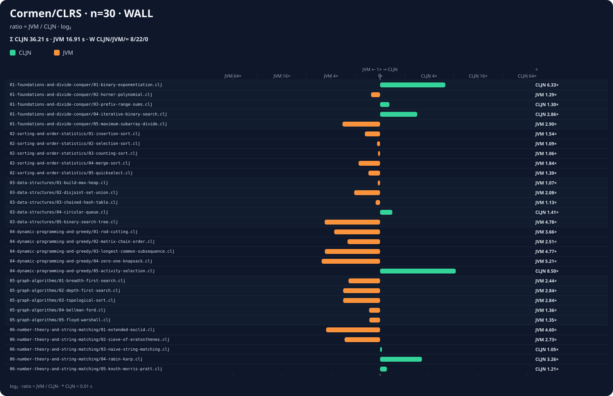
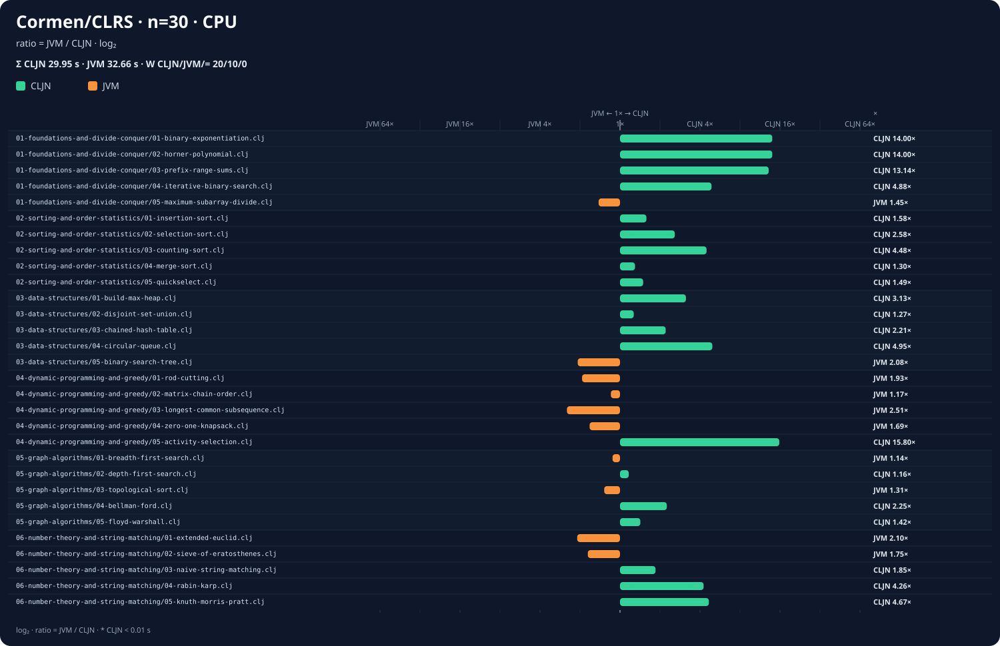
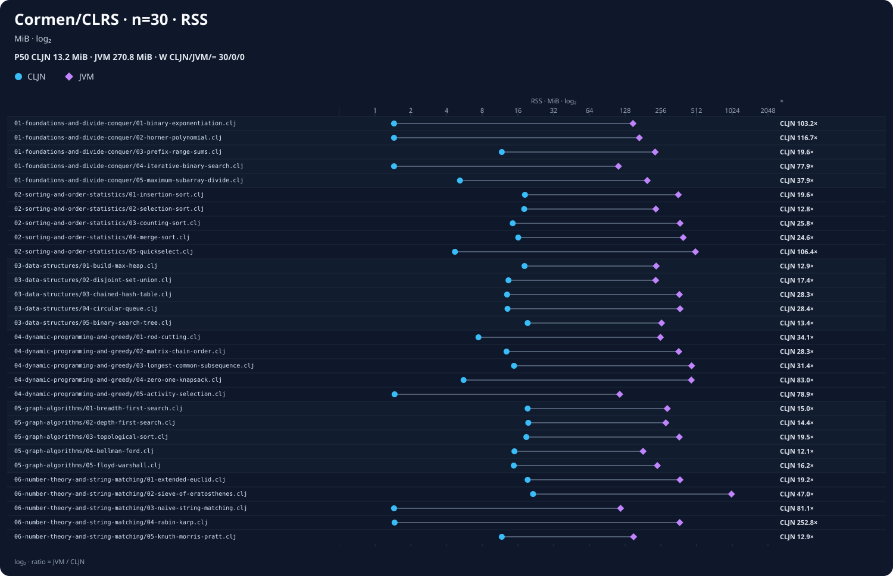

# Comparação extrema de referência — Cormen/CLRS

[Catálogo dos benchmarks](../../README.md) ·
[Guia da suíte](../README.md)

Arquivo: [`extreme.csv`](extreme.csv)

Snapshot do relatório:
[`HEAD 476aefd`](https://github.com/EwertonDCSilv/clojure-compiler/commit/476aefd47bd01c4dca8b11f3e8009fbf2cd78d3c).

Medições nativas atualizadas em 2026-07-27 no commit `1ca1d79` com:

```bash
benchmarks/cormen/run.sh --scale 25 --opt-level none \
  --compiler target/release/clojure-native \
  --csv /tmp/clojure-compiler-cormen-native.csv
```

As colunas `clojure_*`, `clojure_version` e `clojure_checksum` foram preservadas sem
alteração da rodada comparativa anterior. As colunas nativas foram substituídas pela
nova execução; `wall_speedup_vs_clojure`, `cpu_speedup_vs_clojure` e
`rss_ratio_clojure_over_native` foram então recalculadas.

## Ambiente

| Item | Valor |
| --- | --- |
| Arquitetura | x86_64 |
| Sistema | Linux 6.14.0-37-generic |
| CPU | AMD Ryzen 5 8600G, 6 cores / 12 threads |
| Memória | 30 GiB |
| Rust | rustc 1.97.1 |
| Compilador C | GCC 14.2.0 |
| Java | OpenJDK 21.0.9 |
| Clojure/JVM | Clojure 1.12.5, AOT |
| Build do compilador | Cargo `--release` |
| Multiplicador interno | 25× |
| GC | configuração normal |

## Resumo desta execução

- 30 casos comparados, todos com status `OK` e checksums idênticos.
- O nativo teve menor tempo de parede em 15 casos; Clojure/JVM nos outros 15.
- Mediana de `wall_speedup_vs_clojure`: 0,958×, próxima da paridade.
- Tempos de parede acumulados: nativo 29,45 s; Clojure/JVM preservado 16,91 s.
- Tempos de CPU acumulados: nativo 29,30 s; Clojure/JVM preservado 32,61 s.
- O nativo teve menor tempo de CPU em 19 casos; Clojure/JVM em 11.
- Mediana de `cpu_speedup_vs_clojure`: 1,920× a favor do nativo; pela primeira vez
  nesta série, o total de CPU também favorece o nativo.
- O nativo apresentou RSS menor nos 30 casos.
- Mediana de `rss_ratio_clojure_over_native`: 26,296×.
- Maior RSS nativo: 21.892 KiB em
  `06-number-theory-and-string-matching/02-sieve-of-eratosthenes.clj`.
- Maior RSS Clojure/JVM: 1.024.412 KiB no mesmo caso.
- Compilação acumulada: 3.932 ms no nativo e 15.272 ms preservados no Clojure/JVM AOT.

Foram feitas três execuções completas, com tempos acumulados de parede de 29,45 s,
28,79 s e 31,94 s e CPU de 29,30 s, 28,65 s e 31,81 s. O `extreme.csv` guarda
integralmente a execução mediana pelo tempo de parede, de 29,45 s, sem combinar
métricas de processos distintos.

Em relação ao CSV versionado imediatamente anterior, a execução publicada melhorou
18,67% em parede e 18,77% em CPU; 23 casos melhoraram, 4 empataram e 3 pioraram. O
hoisting de literais constantes reduziu `horner-polynomial` de 0,49 para 0,04 s,
`prefix-range-sums` de 0,33 para 0,06 s e `counting-sort` de 0,55 para 0,19 s. A
mudança também alcançou o alvo interprocedural `zero-one-knapsack`, que caiu de 3,70
para 1,91 s. O crivo de Eratóstenes caiu de 4,99 para 4,15 s. Os maiores movimentos
contrários foram BFS, de 1,22 para 1,69 s, e DFS, de 1,39 para 1,86 s.

## Gráficos comparativos

Os gráficos são gerados diretamente do [`extreme.csv`](extreme.csv) por
[`render-benchmark-charts.rs`](../../render-benchmark-charts.rs). Tempo e CPU usam uma
escala logarítmica de razão: verde à direita favorece o nativo e laranja à esquerda
favorece Clojure/JVM. Memória mostra os valores absolutos dos dois processos em MiB.

### Tempo de parede

[](charts/wall-time.svg)

### Tempo total de CPU

[](charts/cpu-time.svg)

### Pico de memória RSS

[](charts/memory-rss.svg)

## Resumo por teste

`N/J` mostra os valores absolutos nativo/Clojure. O delta é
`(nativo - Clojure) / Clojure`: negativo favorece o nativo; positivo favorece a JVM.

| Caso | Tempo N/J (s) | Δ tempo | CPU N/J (s) | Δ CPU | RSS N/J (MiB) | Δ RSS |
| --- | ---: | ---: | ---: | ---: | ---: | ---: |
| `01-foundations-and-divide-conquer/01-binary-exponentiation.clj` | 0.06 / 0.38 | -84.2% | 0.06 / 0.82 | -92.7% | 1.5 / 148.5 | -99.0% |
| `01-foundations-and-divide-conquer/02-horner-polynomial.clj` | 0.04 / 0.38 | -89.5% | 0.04 / 0.82 | -95.1% | 1.5 / 164.4 | -99.1% |
| `01-foundations-and-divide-conquer/03-prefix-range-sums.clj` | 0.06 / 0.43 | -86.0% | 0.06 / 0.90 | -93.3% | 11.9 / 231.8 | -94.9% |
| `01-foundations-and-divide-conquer/04-iterative-binary-search.clj` | 0.14 / 0.40 | -65.0% | 0.14 / 0.85 | -83.5% | 1.4 / 117.8 | -98.8% |
| `01-foundations-and-divide-conquer/05-maximum-subarray-divide.clj` | 1.36 / 0.48 | +183.3% | 1.36 / 0.99 | +37.4% | 5.3 / 197.5 | -97.3% |
| `02-sorting-and-order-statistics/01-insertion-sort.clj` | 0.51 / 0.52 | -1.9% | 0.50 / 0.99 | -49.5% | 18.1 / 362.4 | -95.0% |
| `02-sorting-and-order-statistics/02-selection-sort.clj` | 0.29 / 0.45 | -35.6% | 0.29 / 0.92 | -68.5% | 18.3 / 230.6 | -92.1% |
| `02-sorting-and-order-statistics/03-counting-sort.clj` | 0.19 / 0.52 | -63.5% | 0.19 / 1.00 | -81.0% | 14.5 / 363.8 | -96.0% |
| `02-sorting-and-order-statistics/04-merge-sort.clj` | 0.85 / 0.61 | +39.3% | 0.84 / 1.28 | -34.4% | 16.1 / 396.1 | -95.9% |
| `02-sorting-and-order-statistics/05-quickselect.clj` | 1.30 / 0.92 | +41.3% | 1.30 / 1.91 | -31.9% | 4.8 / 521.5 | -99.1% |
| `03-data-structures/01-build-max-heap.clj` | 0.27 / 0.45 | -40.0% | 0.26 / 0.95 | -72.6% | 18.3 / 233.7 | -92.2% |
| `03-data-structures/02-disjoint-set-union.clj` | 0.69 / 0.51 | +35.3% | 0.69 / 1.04 | -33.7% | 13.5 / 241.9 | -94.4% |
| `03-data-structures/03-chained-hash-table.clj` | 0.48 / 0.60 | -20.0% | 0.48 / 1.19 | -59.7% | 13.0 / 366.6 | -96.5% |
| `03-data-structures/04-circular-queue.clj` | 0.18 / 0.58 | -69.0% | 0.17 / 1.09 | -84.4% | 13.3 / 364.5 | -96.4% |
| `03-data-structures/05-binary-search-tree.clj` | 1.65 / 0.46 | +258.7% | 1.64 / 0.96 | +70.8% | 19.4 / 258.0 | -92.5% |
| `04-dynamic-programming-and-greedy/01-rod-cutting.clj` | 1.76 / 0.53 | +232.1% | 1.76 / 1.00 | +76.0% | 7.6 / 255.2 | -97.0% |
| `04-dynamic-programming-and-greedy/02-matrix-chain-order.clj` | 1.18 / 0.57 | +107.0% | 1.17 / 1.08 | +8.3% | 12.8 / 366.2 | -96.5% |
| `04-dynamic-programming-and-greedy/03-longest-common-subsequence.clj` | 3.55 / 0.81 | +338.3% | 3.54 / 1.37 | +158.4% | 14.9 / 477.4 | -96.9% |
| `04-dynamic-programming-and-greedy/04-zero-one-knapsack.clj` | 1.91 / 0.71 | +169.0% | 1.90 / 1.21 | +57.0% | 5.5 / 509.1 | -98.9% |
| `04-dynamic-programming-and-greedy/05-activity-selection.clj` | 0.04 / 0.34 | -88.2% | 0.04 / 0.76 | -94.7% | 1.5 / 117.1 | -98.7% |
| `05-graph-algorithms/01-breadth-first-search.clj` | 1.69 / 0.50 | +238.0% | 1.68 / 1.03 | +63.1% | 19.4 / 288.7 | -93.3% |
| `05-graph-algorithms/02-depth-first-search.clj` | 1.86 / 0.49 | +279.6% | 1.85 / 1.05 | +76.2% | 19.5 / 284.3 | -93.1% |
| `05-graph-algorithms/03-topological-sort.clj` | 1.41 / 0.56 | +151.8% | 1.40 / 1.11 | +26.1% | 18.8 / 372.4 | -95.0% |
| `05-graph-algorithms/04-bellman-ford.clj` | 0.38 / 0.44 | -13.6% | 0.37 / 0.90 | -58.9% | 14.8 / 171.6 | -91.4% |
| `05-graph-algorithms/05-floyd-warshall.clj` | 0.57 / 0.51 | +11.8% | 0.57 / 1.06 | -46.2% | 14.8 / 234.9 | -93.7% |
| `06-number-theory-and-string-matching/01-extended-euclid.clj` | 2.25 / 0.52 | +332.7% | 2.24 / 1.05 | +113.3% | 19.4 / 372.3 | -94.8% |
| `06-number-theory-and-string-matching/02-sieve-of-eratosthenes.clj` | 4.07 / 1.83 | +122.4% | 4.06 / 2.46 | +65.0% | 21.4 / 1000.4 | -97.9% |
| `06-number-theory-and-string-matching/03-naive-string-matching.clj` | 0.37 / 0.39 | -5.1% | 0.37 / 0.83 | -55.4% | 1.5 / 116.8 | -98.7% |
| `06-number-theory-and-string-matching/04-rabin-karp.clj` | 0.18 / 0.62 | -71.0% | 0.18 / 1.14 | -84.2% | 1.5 / 370.7 | -99.6% |
| `06-number-theory-and-string-matching/05-knuth-morris-pratt.clj` | 0.16 / 0.40 | -60.0% | 0.15 / 0.85 | -82.4% | 11.8 / 143.3 | -91.8% |

## Resultado por capítulo

| Capítulo | Casos | Parede nativo | Parede Clojure | Razão Clojure/nativo |
| --- | ---: | ---: | ---: | ---: |
| Fundamentos e divisão e conquista | 5 | 1,66 s | 2,07 s | 1,247× |
| Ordenação e estatísticas de ordem | 5 | 3,14 s | 3,02 s | 0,962× |
| Estruturas de dados | 5 | 3,27 s | 2,60 s | 0,795× |
| Programação dinâmica e gulosa | 5 | 8,44 s | 2,96 s | 0,351× |
| Algoritmos de grafos | 5 | 5,91 s | 2,50 s | 0,423× |
| Teoria dos números e casamento de strings | 5 | 7,03 s | 3,76 s | 0,535× |

## Como ler a comparação

- `wall_speedup_vs_clojure` é tempo Clojure dividido pelo tempo nativo.
- `cpu_speedup_vs_clojure` é CPU Clojure dividida pela CPU nativa.
- `rss_ratio_clojure_over_native` é RSS Clojure dividido pelo RSS nativo.
- Nas três colunas, valores maiores que `1` favorecem o nativo; valores menores que `1`
  favorecem Clojure/JVM.

Os dois caminhos foram compilados antes de suas respectivas execuções medidas: o
binário pelo `clojure-compiler` e o namespace JVM por AOT. Nesta atualização somente o
nativo foi recompilado e executado. Os custos aparecem separadamente em
`native_compile_wall_ms` e `clojure_compile_wall_ms`.

O total de parede ainda é 1,74× o Clojure/JVM, mas a mediana por caso está próxima da
paridade e o nativo agora usa 10,1% menos CPU acumulada, além de memória
substancialmente menor. A maior concentração restante está em programação dinâmica,
grafos e nos casos de teoria dos números que ainda alocam ou atravessam fronteiras de
função. Essa relação é uma observação dos dados, não uma prova isolada de causalidade.

Os valores são uma fotografia desta máquina; frequência dinâmica, carga do sistema,
toolchain, JIT e sistema operacional afetam o resultado. Para conclusões estatísticas,
repita as medições no mesmo ambiente e compare distribuições, não apenas uma execução.

O compilador release foi reconstruído imediatamente antes da rodada. A fonte C
amalgamada do runtime medido tinha SHA-256
`85f22edf99b6e407dbb8eaa8ddbbd9d2734aef0a8a13694d9517e867ffcf3208`.

## Experimento Cranelift `none` contra `speed`

Arquivos:

- [`cranelift-none-control.csv`](cranelift-none-control.csv)
- [`cranelift-speed.csv`](cranelift-speed.csv)

Os dois níveis foram executados pelo mesmo compilador release, na mesma máquina e com a
mesma escala:

```bash
benchmarks/cormen/compare-clojure.sh --scale 25 --opt-level none \
  --csv benchmarks/cormen/results/cranelift-none-control.csv

benchmarks/cormen/compare-clojure.sh --scale 25 --opt-level speed \
  --csv benchmarks/cormen/results/cranelift-speed.csv
```

| Métrica agregada | `none` | `speed` | Razão `none / speed` |
| --- | ---: | ---: | ---: |
| Tempo de parede | 93,08 s | 97,74 s | 0,952× |
| Tempo de CPU | 92,84 s | 97,49 s | 0,952× |

`speed` foi mais rápido em 5 casos e `none` em 25. A mediana da razão
`none / speed` foi 0,944× tanto para parede quanto para CPU, isto é, a configuração
`speed` apresentou regressão mediana de aproximadamente 5,9%.

A inspeção do KMP mostrou um efeito coerente com pressão de registradores: o frame de
`kmp-count` passou de 96 para 1.312 bytes e o símbolo cresceu de 5.024 para 7.208 bytes
(aproximadamente 44%). O assembly contém spills adicionais. Por isso, o gate rejeita
`speed` como padrão neste estágio; o nível continua disponível de forma explícita para
investigar e corrigir o IR do frontend.

## Validação do fast path de multiplicação

Comparação do baseline `18f58cc` com o commit candidato
`ADR-0006: fast path de fixnum para *`, ambos construídos em release e executados com
`--scale 25 --opt-level none`:

- [`mul-fastpath-before.csv`](mul-fastpath-before.csv)
- [`mul-fastpath-after.csv`](mul-fastpath-after.csv)

| Métrica | Antes | Depois | Variação |
| --- | ---: | ---: | ---: |
| Tempo de parede acumulado | 91,01 s | 91,93 s | +1,01% |
| Tempo de CPU acumulado | 90,78 s | 91,64 s | +0,95% |
| Compilação acumulada | 2.638 ms | 2.659 ms | +0,80% |

O resultado global ficou ligeiramente mais lento: 13 casos melhoraram, 15 pioraram e 2
empataram. A mediana por caso variou +0,37% em parede e 0,00% em CPU, portanto o delta
agregado de 1% deve ser tratado como pequeno e sujeito a ruído. O caso diretamente
favorável mais claro foi `binary-exponentiation`, de 0,20 s para 0,17 s (-15%).

Somando as duas suítes, o tempo de parede passou de 113,58 s para 114,43 s (+0,75%) e o
tempo de CPU de 113,15 s para 113,86 s (+0,63%). O fast path ajuda cargas concentradas
em multiplicação, mas não produziu ganho global mensurável nesta rodada.
