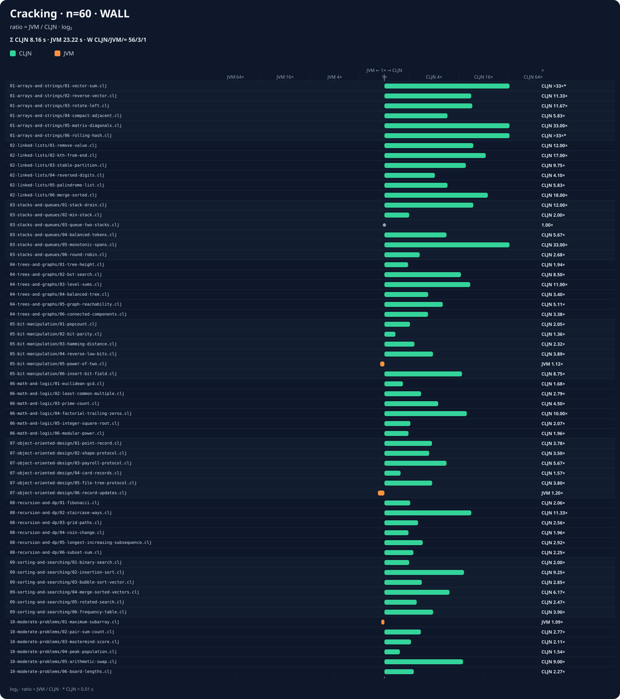
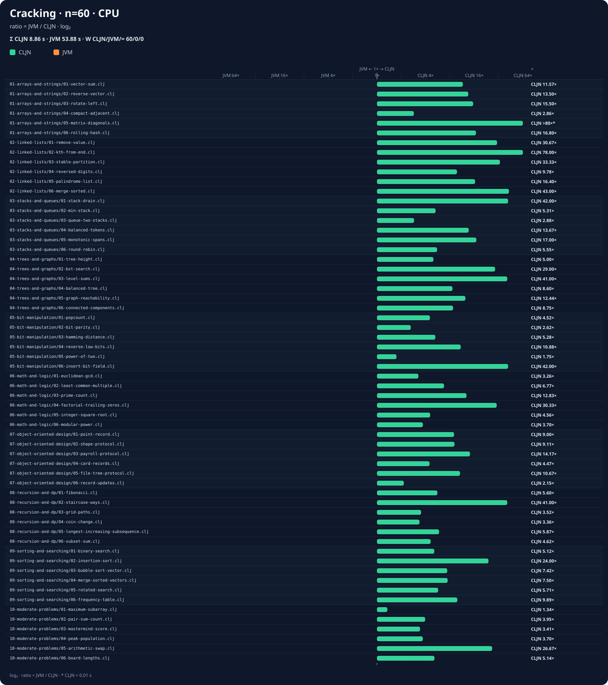
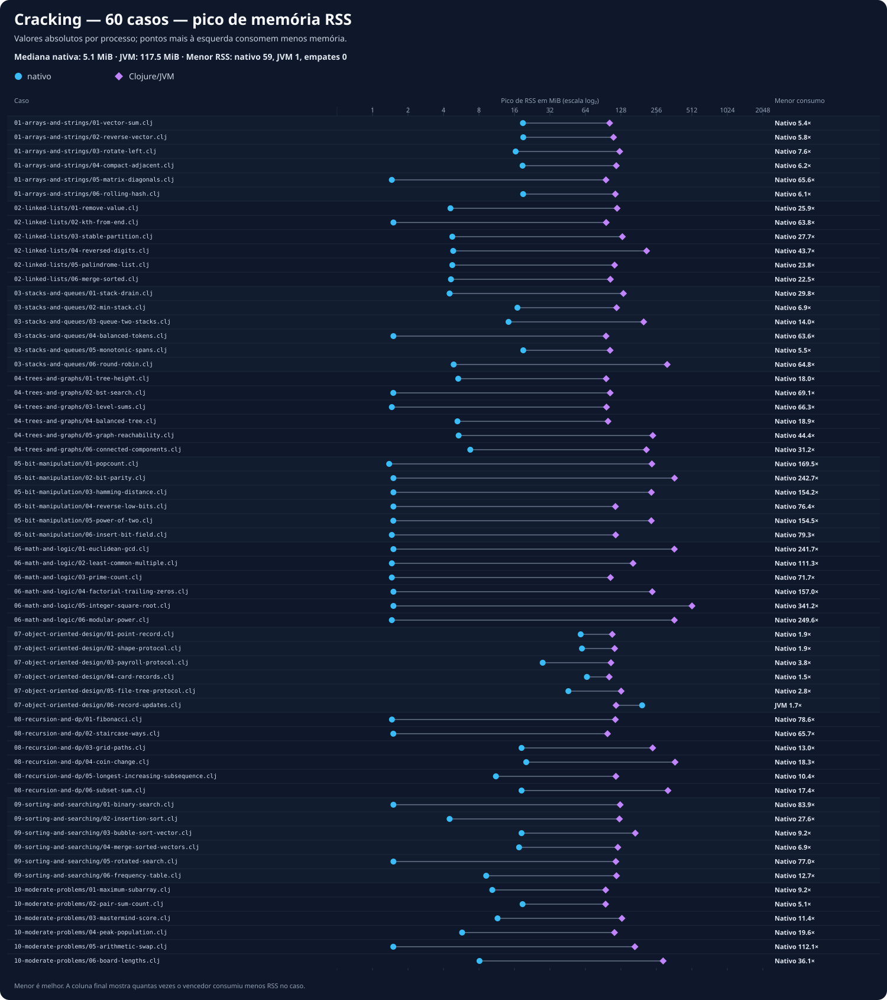

# Comparação extrema de referência

[Catálogo dos benchmarks](../../README.md) ·
[Guia da suíte](../README.md)

Arquivo: [`extreme.csv`](extreme.csv)

Snapshot do relatório:
[`HEAD 424ba20`](https://github.com/EwertonDCSilv/clojure-compiler/commit/424ba20e88fd91a641675e4d9d9bf111c63fc164).

Medições Native × Clojure/JVM refeitas em 2026-07-28 no commit `424ba20` com:

```bash
benchmarks/cracking/compare-clojure.sh --scale 25 \
  --csv benchmarks/cracking/results/extreme.csv
```

Os dois lados foram recompilados e executados nesta rodada. O runner aceitou métricas
somente após validar exit status e igualdade dos checksums.

## Ambiente

| Item | Valor |
| --- | --- |
| Arquitetura | x86_64 |
| Sistema | Linux 6.14.0-37-generic |
| CPU | AMD Ryzen 5 8600G, 6 cores / 12 threads |
| Memória | 30 GiB |
| Rust | rustc 1.97.1 |
| Compilador C | GCC 14.2.0 |
| Java | OpenJDK 21.0.9 |
| Clojure/JVM | Clojure 1.12.5, AOT |
| Build do compilador | Cargo `--release` |
| Multiplicador interno | 25× |
| GC | configuração normal |

## Resumo desta execução

- 60 casos comparados, todos com status `OK` e checksums idênticos.
- O nativo teve menor tempo de parede em 57 casos; Clojure/JVM em 2; houve um empate.
- Mediana de `wall_speedup_vs_clojure`: 3,523× entre os casos mensuráveis.
- Tempos de parede acumulados: nativo 8,05 s; Clojure/JVM 23,02 s.
- Tempos de CPU acumulados: nativo 7,91 s; Clojure/JVM 47,35 s.
- O nativo teve menor tempo de CPU nos 60 casos.
- Mediana de `cpu_speedup_vs_clojure`: 8,009× entre os casos mensuráveis.
- O nativo apresentou RSS menor em 59 dos 60 casos.
- Mediana de `rss_ratio_clojure_over_native`: 33,495×.
- Maior RSS nativo: 194,1 MiB em
  `07-object-oriented-design/06-record-updates.clj`.
- Maior RSS Clojure/JVM: 510,9 MiB em
  `06-math-and-logic/05-integer-square-root.clj`.
- Compilação acumulada: 11.562 ms no nativo e 29.477 ms no Clojure/JVM AOT.

Esta é uma execução completa única. Em relação ao snapshot anterior, o agregado nativo
caiu de 8,16 para 8,05 s de parede (-1,3%) e de 8,06 para 7,91 s de CPU (-1,9%).
Como a JVM também variou nesta rodada, diferenças de frequência, JIT e carga da máquina
impedem atribuir o delta isoladamente às mudanças do compilador.

## Gráficos comparativos

Os gráficos são gerados diretamente do [`extreme.csv`](extreme.csv) por
[`render-benchmark-charts.rs`](../../render-benchmark-charts.rs). Tempo e CPU usam uma
escala logarítmica de razão: verde à direita favorece o nativo e laranja à esquerda
favorece Clojure/JVM. Memória mostra os valores absolutos dos dois processos em MiB.

### Tempo de parede

[](charts/wall-time.svg)

### Tempo total de CPU

[](charts/cpu-time.svg)

### Pico de memória RSS

[](charts/memory-rss.svg)

## Resumo por teste

`N/J` mostra os valores absolutos nativo/Clojure. O delta é
`(nativo - Clojure) / Clojure`: negativo favorece o nativo; positivo favorece a JVM.

| Caso | Tempo N/J (s) | Δ tempo | CPU N/J (s) | Δ CPU | RSS N/J (MiB) | Δ RSS |
| --- | ---: | ---: | ---: | ---: | ---: | ---: |
| `01-arrays-and-strings/01-vector-sum.clj` | 0.00 / 0.32 | -100.0% | 0.00 / 0.70 | -100.0% | 1.4 / 95.4 | -98.5% |
| `01-arrays-and-strings/02-reverse-vector.clj` | 0.03 / 0.32 | -90.6% | 0.02 / 0.72 | -97.2% | 16.1 / 110.3 | -85.4% |
| `01-arrays-and-strings/03-rotate-left.clj` | 0.03 / 0.34 | -91.2% | 0.03 / 0.81 | -96.3% | 10.3 / 117.3 | -91.2% |
| `01-arrays-and-strings/04-compact-adjacent.clj` | 0.06 / 0.35 | -82.9% | 0.05 / 0.74 | -93.2% | 16.1 / 112.6 | -85.7% |
| `01-arrays-and-strings/05-matrix-diagonals.clj` | 0.01 / 0.34 | -97.1% | 0.01 / 0.70 | -98.6% | 1.5 / 92.6 | -98.4% |
| `01-arrays-and-strings/06-rolling-hash.clj` | 0.00 / 0.32 | -100.0% | 0.00 / 0.70 | -100.0% | 1.4 / 112.3 | -98.7% |
| `02-linked-lists/01-remove-value.clj` | 0.03 / 0.34 | -91.2% | 0.03 / 0.74 | -95.9% | 4.6 / 112.6 | -95.9% |
| `02-linked-lists/02-kth-from-end.clj` | 0.02 / 0.33 | -93.9% | 0.02 / 0.69 | -97.1% | 1.5 / 92.6 | -98.4% |
| `02-linked-lists/03-stable-partition.clj` | 0.04 / 0.40 | -90.0% | 0.04 / 0.89 | -95.5% | 4.6 / 135.3 | -96.6% |
| `02-linked-lists/04-reversed-digits.clj` | 0.10 / 0.39 | -74.4% | 0.10 / 0.82 | -87.8% | 4.8 / 211.2 | -97.7% |
| `02-linked-lists/05-palindrome-list.clj` | 0.06 / 0.34 | -82.4% | 0.05 / 0.64 | -92.2% | 4.7 / 107.9 | -95.6% |
| `02-linked-lists/06-merge-sorted.clj` | 0.02 / 0.34 | -94.1% | 0.01 / 0.76 | -98.7% | 4.5 / 103.6 | -95.6% |
| `03-stacks-and-queues/01-stack-drain.clj` | 0.03 / 0.34 | -91.2% | 0.03 / 0.75 | -96.0% | 4.6 / 126.5 | -96.4% |
| `03-stacks-and-queues/02-min-stack.clj` | 0.14 / 0.35 | -60.0% | 0.13 / 0.76 | -82.9% | 16.5 / 112.0 | -85.3% |
| `03-stacks-and-queues/03-queue-two-stacks.clj` | 0.39 / 0.40 | -2.5% | 0.38 / 0.82 | -53.7% | 14.3 / 199.9 | -92.8% |
| `03-stacks-and-queues/04-balanced-tokens.clj` | 0.06 / 0.32 | -81.2% | 0.06 / 0.69 | -91.3% | 1.4 / 92.7 | -98.4% |
| `03-stacks-and-queues/05-monotonic-spans.clj` | 0.01 / 0.33 | -97.0% | 0.01 / 0.69 | -98.6% | 1.4 / 92.5 | -98.4% |
| `03-stacks-and-queues/06-round-robin.clj` | 0.19 / 0.47 | -59.6% | 0.19 / 0.90 | -78.9% | 4.7 / 305.7 | -98.5% |
| `04-trees-and-graphs/01-tree-height.clj` | 0.17 / 0.33 | -48.5% | 0.17 / 0.68 | -75.0% | 5.3 / 93.0 | -94.3% |
| `04-trees-and-graphs/02-bst-search.clj` | 0.04 / 0.33 | -87.9% | 0.04 / 0.68 | -94.1% | 1.4 / 93.3 | -98.5% |
| `04-trees-and-graphs/03-level-sums.clj` | 0.03 / 0.32 | -90.6% | 0.03 / 0.68 | -95.6% | 1.4 / 91.9 | -98.4% |
| `04-trees-and-graphs/04-balanced-tree.clj` | 0.10 / 0.33 | -69.7% | 0.10 / 0.69 | -85.5% | 5.2 / 93.6 | -94.4% |
| `04-trees-and-graphs/05-graph-reachability.clj` | 0.09 / 0.44 | -79.5% | 0.09 / 0.85 | -89.4% | 5.3 / 223.6 | -97.6% |
| `04-trees-and-graphs/06-connected-components.clj` | 0.13 / 0.43 | -69.8% | 0.13 / 0.86 | -84.9% | 6.6 / 206.5 | -96.8% |
| `05-bit-manipulation/01-popcount.clj` | 0.23 / 0.43 | -46.5% | 0.23 / 0.75 | -69.3% | 1.4 / 225.1 | -99.4% |
| `05-bit-manipulation/02-bit-parity.clj` | 0.48 / 0.65 | -26.2% | 0.48 / 1.11 | -56.8% | 1.4 / 361.7 | -99.6% |
| `05-bit-manipulation/03-hamming-distance.clj` | 0.18 / 0.41 | -56.1% | 0.18 / 0.77 | -76.6% | 1.4 / 227.8 | -99.4% |
| `05-bit-manipulation/04-reverse-low-bits.clj` | 0.09 / 0.36 | -75.0% | 0.09 / 0.75 | -88.0% | 1.4 / 112.0 | -98.7% |
| `05-bit-manipulation/05-power-of-two.clj` | 0.45 / 0.40 | +12.5% | 0.45 / 0.76 | -40.8% | 1.4 / 228.0 | -99.4% |
| `05-bit-manipulation/06-insert-bit-field.clj` | 0.04 / 0.35 | -88.6% | 0.04 / 0.77 | -94.8% | 1.5 / 112.5 | -98.7% |
| `06-math-and-logic/01-euclidean-gcd.clj` | 0.33 / 0.49 | -32.7% | 0.32 / 0.87 | -63.2% | 1.4 / 360.5 | -99.6% |
| `06-math-and-logic/02-least-common-multiple.clj` | 0.14 / 0.38 | -63.2% | 0.14 / 0.72 | -80.6% | 1.4 / 156.7 | -99.1% |
| `06-math-and-logic/03-prime-count.clj` | 0.07 / 0.33 | -78.8% | 0.07 / 0.69 | -89.9% | 1.5 / 104.8 | -98.6% |
| `06-math-and-logic/04-factorial-trailing-zeros.clj` | 0.04 / 0.38 | -89.5% | 0.04 / 0.74 | -94.6% | 1.4 / 228.7 | -99.4% |
| `06-math-and-logic/05-integer-square-root.clj` | 0.28 / 0.60 | -53.3% | 0.28 / 1.03 | -72.8% | 1.4 / 510.9 | -99.7% |
| `06-math-and-logic/06-modular-power.clj` | 0.25 / 0.51 | -51.0% | 0.25 / 0.97 | -74.2% | 1.4 / 363.9 | -99.6% |
| `07-object-oriented-design/01-point-record.clj` | 0.09 / 0.34 | -73.5% | 0.08 / 0.75 | -89.3% | 58.2 / 107.6 | -45.9% |
| `07-object-oriented-design/02-shape-protocol.clj` | 0.10 / 0.35 | -71.4% | 0.09 / 0.76 | -88.2% | 59.7 / 110.7 | -46.1% |
| `07-object-oriented-design/03-payroll-protocol.clj` | 0.06 / 0.34 | -82.4% | 0.06 / 0.80 | -92.5% | 27.6 / 106.0 | -74.0% |
| `07-object-oriented-design/04-card-records.clj` | 0.22 / 0.33 | -33.3% | 0.22 / 0.75 | -70.7% | 65.6 / 108.1 | -39.3% |
| `07-object-oriented-design/05-file-tree-protocol.clj` | 0.09 / 0.35 | -74.3% | 0.09 / 0.85 | -89.4% | 46.4 / 128.3 | -63.8% |
| `07-object-oriented-design/06-record-updates.clj` | 0.40 / 0.33 | +21.2% | 0.39 / 0.76 | -48.7% | 194.1 / 116.1 | +67.2% |
| `08-recursion-and-dp/01-fibonacci.clj` | 0.18 / 0.35 | -48.6% | 0.18 / 0.73 | -75.3% | 1.4 / 114.4 | -98.8% |
| `08-recursion-and-dp/02-staircase-ways.clj` | 0.03 / 0.32 | -90.6% | 0.03 / 0.73 | -95.9% | 1.4 / 99.0 | -98.5% |
| `08-recursion-and-dp/03-grid-paths.clj` | 0.16 / 0.38 | -57.9% | 0.15 / 0.83 | -81.9% | 18.2 / 231.7 | -92.1% |
| `08-recursion-and-dp/04-coin-change.clj` | 0.28 / 0.52 | -46.2% | 0.27 / 0.93 | -71.0% | 20.4 / 358.6 | -94.3% |
| `08-recursion-and-dp/05-longest-increasing-subsequence.clj` | 0.13 / 0.40 | -67.5% | 0.13 / 0.86 | -84.9% | 8.2 / 113.5 | -92.8% |
| `08-recursion-and-dp/06-subset-sum.clj` | 0.16 / 0.48 | -66.7% | 0.15 / 0.93 | -83.9% | 18.2 / 317.5 | -94.3% |
| `09-sorting-and-searching/01-binary-search.clj` | 0.19 / 0.38 | -50.0% | 0.19 / 0.78 | -75.6% | 1.4 / 124.3 | -98.8% |
| `09-sorting-and-searching/02-insertion-sort.clj` | 0.04 / 0.38 | -89.5% | 0.04 / 0.84 | -95.2% | 4.6 / 115.9 | -96.1% |
| `09-sorting-and-searching/03-bubble-sort-vector.clj` | 0.11 / 0.39 | -71.8% | 0.11 / 0.86 | -87.2% | 18.1 / 159.6 | -88.7% |
| `09-sorting-and-searching/04-merge-sorted-vectors.clj` | 0.05 / 0.38 | -86.8% | 0.04 / 0.83 | -95.2% | 15.4 / 117.5 | -86.9% |
| `09-sorting-and-searching/05-rotated-search.clj` | 0.15 / 0.39 | -61.5% | 0.15 / 0.78 | -80.8% | 1.5 / 114.5 | -98.7% |
| `09-sorting-and-searching/06-frequency-table.clj` | 0.09 / 0.37 | -75.7% | 0.09 / 0.80 | -88.8% | 9.1 / 115.2 | -92.1% |
| `10-moderate-problems/01-maximum-subarray.clj` | 0.35 / 0.35 | +0.0% | 0.35 / 0.71 | -50.7% | 5.3 / 93.0 | -94.3% |
| `10-moderate-problems/02-pair-sum-count.clj` | 0.12 / 0.33 | -63.6% | 0.12 / 0.70 | -82.9% | 1.3 / 91.9 | -98.5% |
| `10-moderate-problems/03-mastermind-score.clj` | 0.19 / 0.42 | -54.8% | 0.19 / 0.94 | -79.8% | 5.8 / 123.8 | -95.3% |
| `10-moderate-problems/04-peak-population.clj` | 0.24 / 0.36 | -33.3% | 0.24 / 0.70 | -65.7% | 6.1 / 107.8 | -94.4% |
| `10-moderate-problems/05-arithmetic-swap.clj` | 0.04 / 0.38 | -89.5% | 0.04 / 0.79 | -94.9% | 1.5 / 165.3 | -99.1% |
| `10-moderate-problems/06-board-lengths.clj` | 0.22 / 0.59 | -62.7% | 0.22 / 1.05 | -79.0% | 7.8 / 278.1 | -97.2% |
## Como ler a comparação

- `wall_speedup_vs_clojure` é tempo Clojure dividido pelo tempo nativo.
- `cpu_speedup_vs_clojure` é CPU Clojure dividida pela CPU nativa.
- `rss_ratio_clojure_over_native` é RSS Clojure dividido pelo RSS nativo.
- Nas três colunas, valores maiores que `1` favorecem o nativo; valores menores que `1`
  favorecem Clojure/JVM.

Os dois caminhos foram compilados antes de suas respectivas execuções medidas: o
binário pelo `clojure-compiler` e o namespace JVM por AOT. Os custos aparecem
separadamente em
`native_compile_wall_ms` e `clojure_compile_wall_ms`.

Os valores são uma fotografia desta máquina; frequência dinâmica, carga do sistema,
toolchain, JIT e sistema operacional afetam o resultado. Para conclusões estatísticas,
repita as medições no mesmo ambiente e compare distribuições, não apenas uma execução.

O compilador release foi reconstruído imediatamente antes da rodada no commit
`424ba20`.

## Validação do fast path de multiplicação

Comparação do baseline `18f58cc` com o commit candidato
`ADR-0006: fast path de fixnum para *`, ambos construídos em release e executados com
`--scale 25 --opt-level none`:

- [`mul-fastpath-before.csv`](mul-fastpath-before.csv)
- [`mul-fastpath-after.csv`](mul-fastpath-after.csv)

| Métrica | Antes | Depois | Variação |
| --- | ---: | ---: | ---: |
| Tempo de parede acumulado | 22,57 s | 22,50 s | -0,31% |
| Tempo de CPU acumulado | 22,37 s | 22,22 s | -0,67% |
| Compilação acumulada | 5.216 ms | 5.215 ms | -0,02% |

O resultado global ficou essencialmente estável: 18 casos melhoraram, 17 pioraram e 25
empataram na resolução de 0,01 s do runner. Nos 27 arquivos que contêm multiplicação
direta, o tempo acumulado caiu de 7,53 s para 7,29 s (-3,19%). Os ganhos mais claros
foram `least-common-multiple` (0,34 → 0,29 s), `factorial-trailing-zeros`
(0,23 → 0,20 s) e `modular-power` (0,59 → 0,53 s).
