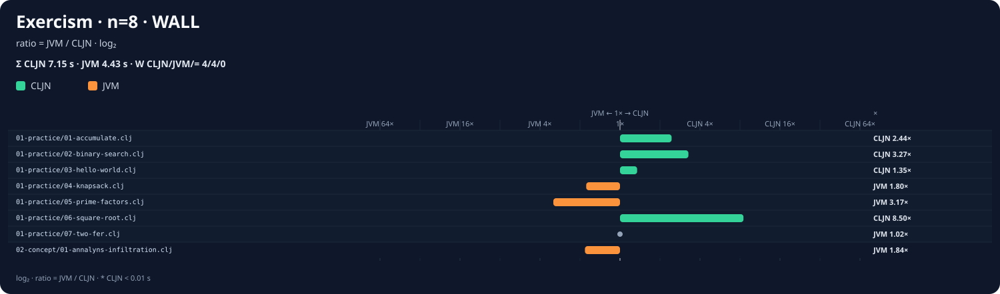
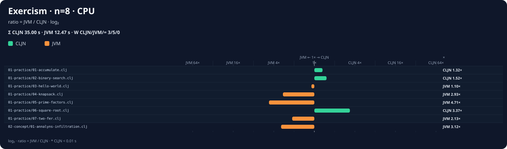
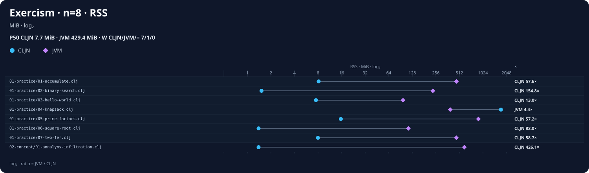

# Exercism external comparison

[Suite guide](../README.md) ·
[Upstream attribution](../UPSTREAM.md) ·
[Implementation plan](../IMPLEMENTATION_PLAN.md) ·
[Practice matrix](compilation.tsv) ·
[Conformance corpus](../../../tests/conformance/level-d-pure-libraries/external/exercism/README.md)

Files:

- [`compilation.tsv`](compilation.tsv): build result for all 101 upstream reference
  solutions;
- [`all-files.tsv`](all-files.tsv): individual build result for all 493 `.clj`/`.cljc`
  files in the checkout;
- [`extreme.csv`](extreme.csv): historical Native × Clojure/JVM comparison for the
  seven practice workloads, before the concept promotion.

The concept compilation matrix is stored with the conformance fixtures at
[`compilation.tsv`](../../../tests/conformance/level-d-pure-libraries/external/exercism/compilation.tsv).
It is a compatibility inventory and is not part of this performance report.

## Snapshots

| Component | Revision |
| --- | --- |
| Compiler checkout used for the published performance measurement | `7607bef9f951b25711307f5f7c936053bc34baf8` |
| Compiler checkout used for practice/full-checkout matrices | `b845a3ae56321443a3754718f9a91da2c0f695ba` |
| Compiler checkout used for the concept-conformance matrix | recorded in the conformance TSV |
| [`exercism/clojure`](https://github.com/exercism/clojure) | [`4a4c4fd0eb5a232ad1e5f2b81c751bfbfcbd0190`](https://github.com/exercism/clojure/tree/4a4c4fd0eb5a232ad1e5f2b81c751bfbfcbd0190) |
| Clojure/JVM | 1.12.5, AOT with HotSpot enabled |
| Internal load multiplier | 5× |

The documentation/results commit is necessarily newer than the measured compiler
baseline.

## Environment

| Item | Value |
| --- | --- |
| Architecture | x86_64 |
| System | Linux 6.14.0-37-generic |
| CPU | AMD Ryzen 5 8600G, 6 cores / 12 threads |
| Memory | 30.5 GiB |
| Rust | rustc 1.97.1 |
| C compiler | GCC 14.2.0 |
| Java | OpenJDK 21.0.9 |
| Native build | Cargo `--release`, default Cranelift level |

## Compatibility result

- 101 public reference implementations compiled.
- 7 passed `clojure-native build`.
- 94 failed at a tracked first blocker.
- All 13 official concept exemplars are versioned as conformance cases; 1 is active
  and 12 are expected failures with tracked first blockers.
- Across complete official solutions, the current inventory is 8/114 passing.
- The complete checkout contains 493 Clojure files: 116 build individually and 377
  fail. This includes 101 practice references, 13 concept exemplars, 120 source/stub
  files, 114 tests, 113 `project.clj` files, 30 generators and 2 tooling files.
- The largest first-blocker groups are top-level values (`19`), missing core functions
  (`18`), regex (`16`) and missing core macros (`11`).

## Performance result

- 7/7 workloads produced identical Native and JVM checksums.
- Accumulated wall time: Native `5.63 s`, JVM `3.77 s`.
- Accumulated CPU time: Native `5.61 s`, JVM `7.26 s`.
- Native used less wall time in 4 cases and less CPU in 6 cases.
- JVM used less wall time in `knapsack`, `prime-factors` and `two-fer`.
- Native used less RSS in 6 cases. `knapsack` is the exception and reaches
  `351.3 MiB` natively versus `248.1 MiB` on the JVM.
- `prime-factors` is the main native performance deficit: `3.62 s` versus `1.18 s`
  wall time.

The accumulated wall result favors the JVM because `prime-factors` dominates this
small suite. The accumulated CPU result favors Native, while process memory strongly
favors Native in most cases. This is an initial engineering baseline, not a general
performance claim.

## Charts

### Wall time

[](charts/wall-time.svg)

### Total CPU

[](charts/cpu-time.svg)

### Peak RSS

[](charts/memory-rss.svg)

## Per-case summary

`N/J` means Native/Clojure JVM. Delta is `(Native - JVM) / JVM`: negative values favor
Native.

| Case | Wall N/J (s) | Δ wall | CPU N/J (s) | Δ CPU | RSS N/J (MiB) | Δ RSS |
| --- | ---: | ---: | ---: | ---: | ---: | ---: |
| `01-practice/01-accumulate.clj` | 0.17 / 0.45 | -62.2% | 0.16 / 0.94 | -83.0% | 8.3 / 231.9 | -96.4% |
| `01-practice/02-binary-search.clj` | 0.10 / 0.36 | -72.2% | 0.10 / 0.81 | -87.7% | 1.5 / 116.4 | -98.7% |
| `01-practice/03-hello-world.clj` | 0.15 / 0.33 | -54.5% | 0.15 / 0.73 | -79.5% | 7.6 / 97.5 | -92.2% |
| `01-practice/04-knapsack.clj` | 1.02 / 0.58 | +75.9% | 1.02 / 1.22 | -16.4% | 351.3 / 248.1 | +41.6% |
| `01-practice/05-prime-factors.clj` | 3.62 / 1.18 | +206.8% | 3.62 / 1.74 | +108.0% | 15.6 / 1004.9 | -98.4% |
| `01-practice/06-square-root.clj` | 0.03 / 0.35 | -91.4% | 0.03 / 0.77 | -96.1% | 1.5 / 97.1 | -98.5% |
| `01-practice/07-two-fer.clj` | 0.54 / 0.52 | +3.8% | 0.53 / 1.05 | -49.5% | 8.0 / 371.8 | -97.8% |

Reproduce:

```bash
benchmarks/exercism/compare-clojure.sh \
  --scale 5 \
  --csv benchmarks/exercism/results/extreme.csv
```
